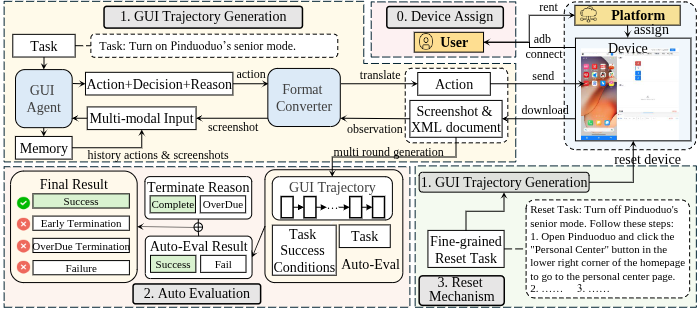

# MobileBench-OL: Online Evaluation Framework for Mobile GUI Agents



MobileBench-OL is a framework for evaluating mobile GUI agents on real Android devices. It supports multiple agents/models to collect task trajectories and automatically evaluate them using rule/xpath criteria.

- Real-device interaction: operate a physical device via `uiautomator2`
- Unified agent interface: UI‑TARS, GPT‑4o, M3A/T3A, Qwen2.5‑VL, Mobile Agent V2
- Automated evaluation: consistent assessment with rule/xpath on recorded trajectories
- Reproducibility: tasks and outputs are persisted to disk, supporting resume and multi‑round retries

---

## Environment & Installation

Tested under:
- Python 3.10
- Android device with Developer Options and USB debugging enabled (USB or Wi‑Fi ADB)

Core Python dependencies:
- uiautomator2
- Pillow (PIL)
- opencv-python (cv2)
- numpy

Install example:
```bash
pip install uiautomator2 pillow opencv-python numpy
```

### Mobile Agent V2 Notes
If you plan to use **Mobile Agent V2**, follow the official environment setup guide:
[https://github.com/X-PLUG/MobileAgent/tree/main/Mobile-Agent-v2](https://github.com/X-PLUG/MobileAgent/tree/main/Mobile-Agent-v2)

---

## Supported Agents/Models

| Model | `model.name` | Source |
|---|---|---|
| [UI-TARS-1.5](https://huggingface.co/ByteDance-Seed/UI-TARS-1.5-7B) | `uitars_1_5` | ByteDance |
| GPT-4o | `gpt4o` | OpenAI |
| M3A (from [AndroidWorld](https://github.com/google-research/android_world/tree/main)) | `m3a` | Google |
| T3A (text-only, powered by GPT‑4o) | `t3a` | - |
| Qwen2.5‑VL | `qwen2_5vl` | Qwen |
| [Mobile Agent V2](https://github.com/X-PLUG/MobileAgent/tree/main/Mobile-Agent-v2) | `mobileagentv2` | Qwen |

Notes:
- M3A/T3A use Azure OpenAI/GPT‑4o and require `[azure]` section in config.
- Mobile Agent V2 requires API URL, Token, and image caption settings (Qwen VL).

---

## Quick Start

### 1) Connect a device
- Enable Developer Options & USB debugging
- Run `adb devices` and put the serial into `[device] id` in config

### 2) Choose a config
Sample configs are provided under `config/`:
- `interact.conf` (UI‑TARS sample)
- `interact_uitars15_*.conf`, `interact_gpt4o_*.conf`, `interact_m3a_*.conf`, `interact_t3a_*.conf`, `interact_qwen2_5vl_*.conf`, `interact_mobileagentv2_*.conf`
- For evaluation: `evaluate.conf`

### 3) Collect trajectories (interact mode)
```bash
python3 run.py --mode interact \
  --config config/interact.conf \
  --subset base \
  --output results/uitars1.5_1114
```
Parameters:
- `mode`: `interact` (collect) or `evaluate` (assess existing trajectories)
- `config`: path to the config file
- `subset`: task subset from the benchmark: `[base, long-tail, long-horizon, gui-reasoning, noise-robust]`
- `output`: output directory (e.g., `results/round1`)

Runtime behavior (see run.py):
- Multi‑round retries: iterate `retry.retry_rounds`, only retry unfinished tasks (run.py:51‑116)
- Resume: `result_list.txt` cache in output dir (task_executor.py:277‑314)
- Noise robustness: if `subset` contains `noise`, run four noise types sequentially (`repeat / unexecuted / delay / popup`) (run.py:117‑156)

### 4) Evaluate trajectories (evaluate mode)
```bash
python3 run.py --mode evaluate --config config/evaluate.conf
```
Config example (`config/evaluate.conf`):
```ini
[evaluation]
trajectory=results/round1
rule=data/top12.csv
reset=false
type=xpath
```
- `trajectory`: directory containing collected trajectories
- `rule`: rule CSV (e.g., `data/top12.csv`)
- `reset`: whether to run reset evaluation
- `type`: currently `xpath`

---

## Configuration

Example layout (varies by model):
```ini
[device]
id=<device serial>

[model]
name=<uitars_1_5 | gpt4o | m3a | t3a | qwen2_5vl | mobileagentv2>
url=<API endpoint>
# For mobileagentv2: also token / qwen_api / caption_model

[retry]
retry_rounds=<rounds>
connect_retry=<reconnect attempts>
fail_retry=<per-task retries>

[reset]
reset=<true|false>

[operation]
max_steps=<max steps>
back_times=
sleep_seconds_per_act=<seconds>

[task]
task_file=data/<tasks.csv>
output=results/<output-dir>
```

At runtime, these are combined as `url|token|qwen_api|caption_model` (run.py:78‑84, task_executor.py:211‑217).

---

## Usage Examples per Model

Below are ready-to-run examples using the sample configs under `config/`. Fill in your device id and model service parameters first.

### UI‑TARS‑1.5
```bash
python3 run.py --mode interact \
  --config config/interact_uitars15_base.conf \
  --subset base \
  --output results/uitars1.5_run
```

Tip: for noise‑robust evaluation, set `--subset noise-robust` to run `repeat / unexecuted / delay / popup` sequentially with the same output directory (run.py:117‑156).

---

## Project Structure

```text
.
├── assets/
│   └── pipeline.png
├── config/
│   ├── interact.conf
│   ├── interact_*.conf
│   └── evaluate.conf
├── data/
│   ├── top12.csv
│   ├── longtail.csv
│   ├── MobileBench-OL - Long-Horizon.csv
│   └── ...
├── mobilebench/
│   ├── eval/
│   │   ├── evaluator_xpath.py
│   │   └── evaluator_xpath_step_ratio.py
│   ├── models/
│   │   ├── llm_core_*.py
│   │   └── execute.py
│   └── utils/
│       ├── task_executor.py
│       ├── agent*.py
│       ├── adb_executor.py
│       └── ...
├── MobileAgent_new/
│   └── Mobile-Agent-v2/
├── run.py
├── README.md
└── README_EN.md
```

- assets/: images and diagrams
- config/: interaction/evaluation configs (samples for each agent)
- data/: benchmark task CSVs (base, long-tail, long-horizon, gui-reasoning, noise-robust)
- mobilebench/: core framework code
  - eval/: evaluators (xpath/step-ratio)
  - models/: LLM wrappers/calls
  - utils/: device/execution/parsing helpers (e.g., task_executor, adb_executor)
- MobileAgent_new/Mobile-Agent-v2/: optional integration for Mobile Agent V2
- run.py: entry script (interact/evaluate)
- README.md (Chinese), README_EN.md (English)

---

## Data & Outputs

- Task CSV (required columns):
  - `task_identifier`, `goal`, `adb_home_page`, `golden_steps`, `key_nodes`
  - Optional: `reset_xpath`, `reset_query`
  - Loader: see mobilebench/utils/task_executor.py:319‑337

- Output directory layout:
  - `results/<run_name>/result_list.txt`: space‑separated `task_id,success` pairs (task_executor.py:305‑314)
  - `results/<run_name>/<task_id>/trajectory.json`: per‑task details (action / image / response / summary / success) (task_executor.py:297‑304)

- Pass rate: printed as `Overall pass rate: xx.xx%` (run.py:114‑116)

---

## Troubleshooting

- Connection failures (`uiautomator2` not available / cannot connect)
  - Ensure `adb devices` lists the device
  - Try different cable/port or Wi‑Fi ADB
  - Automatic reconnects controlled by `connect_retry` (task_executor.py:60‑77, 363‑379)

- Missing tasks or CSV fields
  - Check `task_file` points to a valid CSV with required columns (task_executor.py:319‑337)

- No evaluation results
  - Ensure `evaluation.trajectory` points to output dir and `evaluation.rule` is a valid rule CSV

- Noise robustness (`subset` contains `noise`)
  - Runs sequentially with `repeat / unexecuted / delay / popup`, output directory unchanged (run.py:117‑156)

---

## License

Dataset: [Creative Commons Attribution‑NonCommercial‑ShareAlike 4.0 International (CC BY‑NC‑SA 4.0)](https://creativecommons.org/licenses/by-nc-sa/4.0/)

Source code: [Apache 2.0](http://www.apache.org/licenses/LICENSE-2.0)

Summary:
- Attribution: credit, license link, and indicate changes
- NonCommercial: no commercial use
- ShareAlike: derivatives must be released under the same license

[](https://creativecommons.org/licenses/by-nc-sa/4.0/)

---

## Citation
```
@article{wu2026mobilebench,
  title={MobileBench-OL: A Comprehensive Chinese Benchmark for Evaluating Mobile GUI Agents in Real-World Environment},
  author={Wu, Qinzhuo and Yang, Zhizhuo and Li, Hanhao and Gao, Pengzhi and Liu, Wei and Luan, Jian},
  journal={arXiv preprint arXiv:2601.20335},
  year={2026}
}
```
